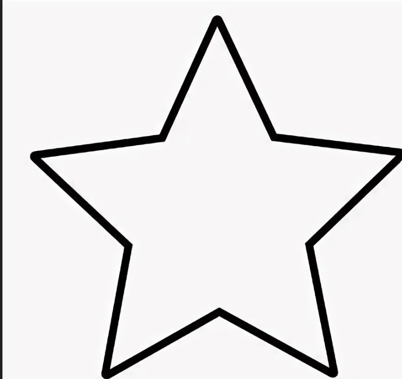
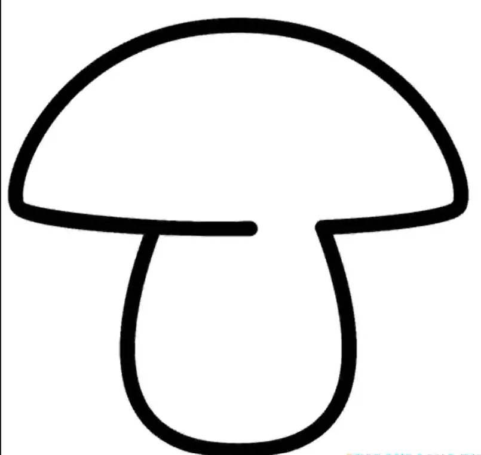

# Мы команда R 

## Цель  работы
v1. Разработка кода, позволяющего нарисовать контур звезды и гриба. Отработка навыков программирования и работе в команже

v2. Создание программного обеспечения, позволяющего генерировать графические контуры звезды и гриба. Развитие компетенций в области программирования и эффективной работы в команде.

## Миссия 
* Взлёт с синей светодиодной индикацией.
* Создания контура звезды с жёлтой индикацией.
* Создания контура гриба с фиолетовой индикацией.
* Возврат и посадка с красной светодиодной индикацией.

## Техническое описание 

**1. Описание фигур:**  
 **Звезда:**
 
 
**Гриб:** Графический объект, состоит из шляпки (полукруг ) и ножки (скруглённый прямоугольник).  

**2. Параметры размещения:**  
 Обе фигуры расположены в одной плоскости, параллельной стене.  
Расстояние от плоскости фигур до стены составляет **~0,5 метра**.

**3. Цветовое решение:**  
Звезда и гриб имеют различные цвета для визуального различения.  
Цвета заданы в RGB с возможностью программного изменения.  

**4. Техническая реализация:**  
 Язык программировани Python, библиотеки rospy, math и другие
 Для удобства для каждой фигуры была создана функция

## 📖 содержание
  
* [Код ](program.py)
* [Техническое описание Word](https://github.com/Muha-bz/Team-R-afrthomatics/blob/main/Техническое%20описание.docx)
* [Видео результат проделанной работы](https://disk.yandex.ru/d/P7FZr041OZHhqg)
